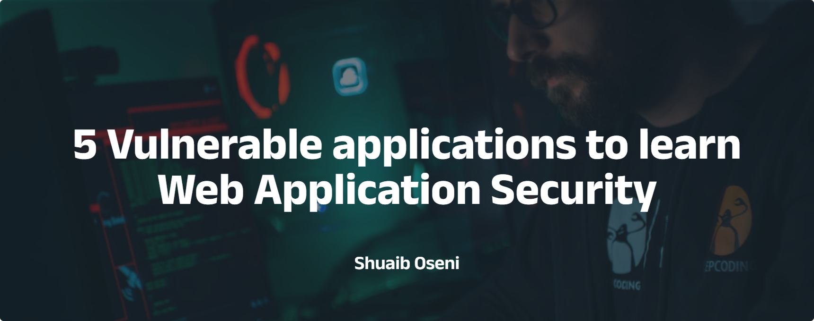

--- 
draft: false
date: 2023-04-15
title: "5 Vulnerable applications to learn Web Application Security"
description: "List of resources to help developers and security researchers learn web application security"
slug: ""
authors: ""
tags:
- application security
images:

  - url: hero.png
    alt: cover image
categories: ""
externalLink: ""
series: ""
---

Web application security is a critical aspect of modern-day technology, and it's essential for developers, security professionals, and anyone involved in building or maintaining web applications to understand the potential risks and vulnerabilities. 

One of the most effective ways to learn about web application security is by setting up a lab and getting hands-on experience with vulnerable applications.

In this article, we'll look at ten vulnerable applications you can use to learn more about web application security. 

**NB:** These applications are intentionally designed to have security flaws, providing an excellent opportunity to practice identifying and exploiting vulnerabilities. Hence, using a virtual machine is highly recommended. 

# Damn Vulnerable Web Application (DVWA): 

DVWA is an open-source PHP/MySQL web application intentionally designed to be vulnerable to attacks, such as SQL injection, XSS, and command execution. It's an excellent starting point for beginners learning about web application security. 

Some of the features of DVWA include:

- Easy installation and setup
- Most common web vulnerabilities
- Various difficulty levels
- Runs on a local machine

%[https://github.com/digininja/DVWA]

# Juice-Shop

Juice-Shop is a vulnerable web application written in Node.js. It is an open-source project by [Open Worldwide Application Security Project (OWASP)](https://owasp.org/). It's designed to be used by developers, security professionals, and anyone interested in learning about web application security.

OWASP Juice-Shop has been designed around the [OWASP Top 10](https://owasp.org/www-project-top-ten/) so developers and security researchers can see how these risks play out in real life. To use this vulnerable application, you can either use the [online](https://juice-shop.herokuapp.com/#/) version or spin up a local instance of the application.

%[https://github.com/juice-shop/juice-shop]

# WebGoat

WebGoat is another vulnerable web application written in Java. It is maintained by OWASP and designed to teach web application security and penetration techniques. It provides a safe and controlled environment to practice various web application security vulnerabilities.

%[https://github.com/WebGoat/WebGoat]

# Multillidae II

Mutillidae II is a free, open-source web application designed to be vulnerable to various web application attacks. It's a perfect application for those who want to learn about web application security through hands-on experience. Multillidae supports both Windows and Linux using LAMP, WAMP, and XAMMP.

OWASP also maintains this project.

%[https://github.com/webpwnized/mutillidae]

# bWAPP

bWAPP is an open-source vulnerable web application intentionally designed to be insecure. It helps developers, security researchers, and anyone interested in application security learn and practice various web application security vulnerabilities.

%[https://github.com/raesene/bWAPP]

# Conclusion

Using vulnerable applications is an excellent way to get hands-on experience identifying and exploiting vulnerabilities. Remember, you can only get better with practice! I hope you find these resources helpful.

# Resources
- [How to setup DVWA](https://www.google.com/url?sa=t&rct=j&q=&esrc=s&source=web&cd=&cad=rja&uact=8&ved=2ahUKEwioz4fWyar-AhXzhf0HHcJ9BKgQwqsBegQITRAF&url=https%3A%2F%2Fwww.youtube.com%2Fwatch%3Fv%3DjJbMkqUezpI&usg=AOvVaw1t8odrrlrq3V6dann4g-F7)
- [Running OWASP Juice-Shop](https://pwning.owasp-juice.shop/part1/running.html)
- [Getting started with WebGoat](https://blog.razrsec.uk/getting-started-with-webgoat/)
- [How to Install Multillidae on Linux](https://www.youtube.com/watch?v=TcgeRab7ayM)
- [How to setup bWAPP](https://vk9-sec.com/how-to-set-up-bwapp-linux/)
