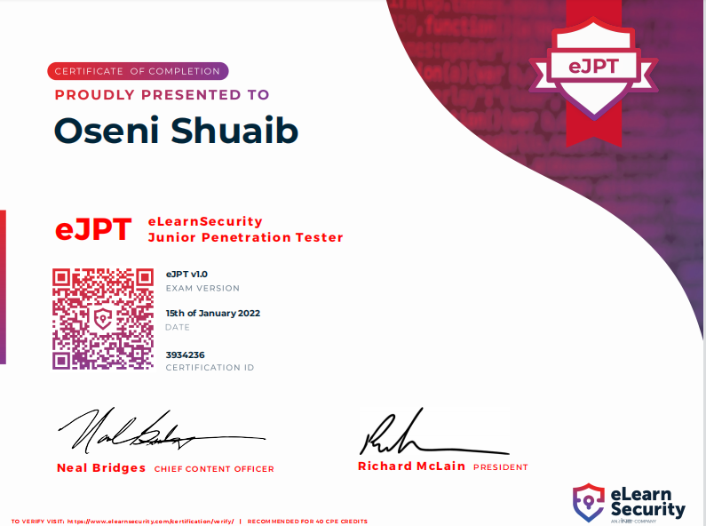

--- 
draft: false
date: 2022-01-12T12:31:06+01:00
title: "My eJPT exam review"
description: "My experience while taking the eJPT exam."
slug: ""
authors: ""
tags:
- certification
- security
images:

  - url: ejpt.png
    alt: cross-site scripting attacks
categories: ""
externalLink: ""
series: ""
---

I recently took the eJPT exam and passed(yayyyy!!!), and I’d like to give a review of the exam, the process, and what to expect without giving too much out.

<!--more-->
### About Me
Before taking the exam, the only form of experience I had with pentesting was with an internship I had completed before taking the exam, and also pwning machines on hackthebox.

After passing my CEH exam in 2021, my mentor advised I took the eJPT exam considering that it's practically based, unlike CEH which is MCQ based. Honestly, eJPT turned out to be an enjoyable exam even though I was so frustrated on exam day.

### eJPT

The eLearnSecurity Junior Penetration Tester(eJPT) exam is a practical exam. You are given 20 MCQ questions, which can only be answered by hacking into the provided network. It is an open book exam, and you are required to answer 15 questions correctly in other to pass. You also have 3days to complete the exam which is more than enough for the exam.

### INE Starter Pass
eLearnSecurity provides a free course for this exam through its learning platform (INE), which is more than enough to pass the exam. You also get free lab access for practice.

Complete the course and you’ll be fine.

### Exam Day
Beautiful Friday morning, I planned on starting by 8 am and probably finishing before the Jumah prayer(i couldn't lol). I was all set for the exam, turned on my pc, booted up my VM, then tried to log into my account, only to find out my kali wasn’t connecting to the internet lol. Let me restart the VM I said! I ended up restarting about 5 times and it was still the same. checked my VM settings, everything looked fine.

I was beginning to get pissed already. Reached out to a friend for help, told me to run some commands which I did.... still the same bro!. We got on TeamViewer so he could check and run commands himself. Long story short, we spent about 3hrs trying to solve this problem(my face was already looking like that of a hungry and frustrated guinea fowl).

He eventually got it fixed...I think I need to get him a cold drink(14 days after and I'm still thinking).

After Clicking the beginning certification process I was instructed to download the Letter of Engagement, It had some Important details about the exam. I downloaded my VPN pack and connected it to the exam network, Then I proceeded to do a ping sweep to determine hosts that were alive.

Enumeration is very important in other to pass the exam, also look at the questions first before pen-testing.

After submitting the exam, I got 18/20.

### Tips for the exam
- Enumeration
- Learn how routing works...very important
- take notes during the course and exam
- Check your VPN connection at intervals, mine kept disconnecting after some hours.
- complete course material with labs

### Final Thoughts
The PTS course was awesome! learned a lot and also added some sets of new tools to my arsenal. The exam is quite different from a CTF. There’s no holding back, you are allowed to use any tool you are comfortable with. I would recommend this certification to anyone looking to get started in Penetration Testing because it’s easy enough to be beginner-friendly and enough to challenge you.

 