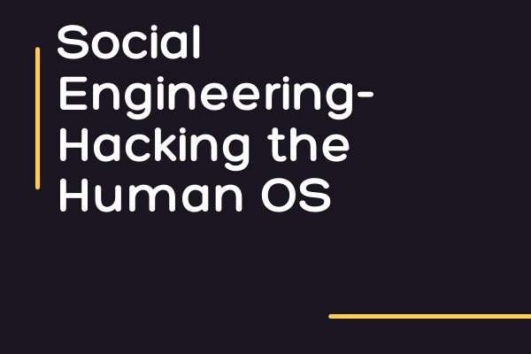

--- 
draft: false
date: 2021-06-20T20:31:06+01:00
title: "Social Engineering - Hacking The Human OS"
description: "In the area of cybersecurity, there are many different forms of attacks, but one of the most common is social engineering."
slug: ""
authors: ""
tags:
- social engineering
images:

  - url: social-engineering.png
    alt: social engineering
categories: ""
externalLink: ""
series: ""
---

In the area of cybersecurity, there are many different forms of attacks, but one of the most common is social engineering.

<!--more-->
### What is social engineering?
Social engineering is the art and science of manipulating people into divulging sensitive information. The types of information social engineers are seeking vary, but when individuals are targeted, social engineers are usually trying to trick you into giving them your password, credit card numbers, or even access to your computers in other to install malicious software.

Social engineers use the vulnerability of human nature as their most effective tool. Fear and greed are the most vulnerable emotions that are usually taken advantage of by social engineers. The natural human tendency to trust others is the basis of any social engineering attack.

Rather than vulnerabilities in software or operating systems, social engineering relies heavily on human error. 

### Types of Social Engineering Attacks
In a social engineering attack, the attacker uses social skills to trick the victim into giving out personal information such as phone numbers, passwords, or confidential information about their organization, and use them to commit fraud or launch an attack. 

Social engineering attacks are classified into three parts:

### Human-based Social Engineering

Human-based social engineering involves human interaction. Here, the attacker interacts with the victim to collect sensitive information. For example, impersonating IT support technicians, customer care centers, bank account officers, and so on.

Attackers perform human-based social engineering attacks by using the following techniques:

### mpersonation

This is a common human-based social engineering technique where an attacker pretends to be a legitimate person. Impersonation attacks are performed physically, over the phone, or any other medium of communication to trick the victim into revealing confidential information.

### Eavesdropping

Eavesdropping refers to listening secretly to the private conversation of others. This includes the interception of any form of communication, including video, audio, or written, using mediums like telephone, social messaging, and email. 

### Piggybacking

Piggybacking refers to the entry into the building with the consent of an authorized person. For example, an attacker would request an authorized person to unlock a security door, with the excuse that they have forgotten their ID badge. Due to courtesy, the authorized person will allow the attacker to pass through.

# Computer-based Social Engineering

This type of social engineering involves the usage of malicious programs such as viruses, trojans, and spyware. Below are some common types of computer-based social engineering attacks:

### Pop-Up windows
Pop-up trick compels users into clicking a hyperlink that redirects them to fake web pages(common on websites where you download free movies...lol)asking for personal information or downloading malicious programs(eyeing those that want to win iPhone 12pro max by just clicking a spinner button).

### Phishing
My favorite (I'm not a bad guy, I promise)...

Phishing is a technique in which an attacker sends an email or provides a malicious link falsely claiming to be from a legitimate site or organization in an attempt to acquire a user's personal information. Attackers register fake domains, build a lookalike website, and then mail the website link to several users. When a user clicks on the email link, it redirects him/her to the fake webpage, where he or she is lured into sharing sensitive information such as credit card or address information. Remember that unsolicited lottery or $5000 emails you get in your spam...yeah, you know what it means now.

# Mobile-based Social Engineering

### Publishing Malicious Apps
Here, the attacker performs social engineering attack using malicious mobile apps. The attacker creates an application, such as a gaming app with attractive features, and publishes them on major app stores. Users download the application on their mobile devices believing it to be a genuine one. Once the application is installed, the user's device is infected with malware and sends the user's information(username, contacts, password, and so on) to the attacker.

### Smishing(SMS Phishing)
Sending SMS is another technique used by attackers for performing mobile-based social engineering. SMS text messaging system is used to lure users into actions such as downloading malware or calling a fraudulent phone number.

### Protecting Yourself from Social Engineering Attacks
- Using multifactor authentication: User credentials are one of the valuable pieces of information attackers seek.  - Using multifactor authentication helps ensure your accounts are protected in the event of system compromise.
- Asking for verification: Always ask for verification when someone calls you claiming to represent an organization, eg. your bank. Never share confidential details such as credit card numbers or passwords over the phone or email.
- Be careful of tempting offers: You are never going to win an iPhone by sending a link to five people and three groups on WhatsApp(yes I'm talking to you). If an offer sounds too enticing, think twice before accepting it as fact.
- Installing email and spam filters: Though spam filters cannot catch highly targeted attacks(creepy stuff right?), they will prevent most of the spam and malicious emails from reaching your account.
- Keeping antivirus and antimalware updated: Make sure this software is being updated from time to time, and also scan your systems for infections.
- Education: The best way to prevent yourself and your organization from attacks are getting to train your staff and familiarize them with all these different tactics. You as a boss are not excluded.

### Conclusion
Social Engineers eat and breath "manipulation". They work with people's emotions - especially "greed" and "fear". So whenever you're acting based on two feelings, you might want to slow down and check if you are being manipulated. 

Here is a video demonstrating a [social engineering attack](https://youtu.be/fHhNWAKw0bY)