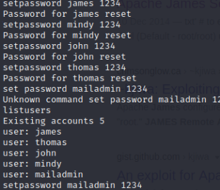

--- 
draft: true
date: 2022-02-17T17:31:06+01:00
title: "Solid State Walkthrough - Hackthebox"
description: "A walkthrough of hackthebox machines"
slug: ""
authors: ""
tags:
- Hackthebox
- Walkthrough
images:

  - url: 
    alt: 
categories: ""
externalLink: ""
series: ""
---
I'll be starting a blog series on HackTheBox retired machines, and this will be the first machine i'll be publishing a walkthrough on.

<!--more-->
### Why retired machines?
HackTheBox allows writeups or walkthrough's for retired machines only.

### Machine Info
Box Name  ⇒ SolidState

IP  ⇒  10.10.10.51

OS  ⇒  linux

Let's fire up our VPN comrades, we're going on a ride!

### Recon
Let's start by running a Nmap scan to gather information about the open ports and services running on this machine.

```bash
nmap -A -T4 -p-  10.10.10.51
```


From the scan result we can tell that some ports are open. My methodology is to always start with `port 80` if it shows up in a scan result.


### Enumeration
After going through the web pages, found a contact form, which means a POST request is going to be made. Viewing the page source of the page, we find a mail address. Other than that, its a basic website.


Let's move on to other ports. Port `4555` looks good, namp gave us a service name and version number. Looking it up on google, we found default credentials [ root / root ].

### Initial Foothold
Let's try to log in via netcat with the default credentials.

Next, let's run `HELP` to see the list of available commands.


Ran the listusers command to see the available users


Since the `setpassword` command is available, let's use it to reset all the users password.



According to our nmap scan, `pop3` is available. Let's check if it is juicy using telnet.

Let's login with a user and use the `LIST` command to list messages.


Nothing juicy or interesting for user Thomas. Moving on to another user


Noisssssse!! looks like Mindy recieved a mail from james, which contains ssh login credentials. Let's try to login via ssh using this credentials.


Bingo! 

Let's poke around a little to see if we can find the user-flag.

[]()

Going back to our scan, we can see that the machine is running `james server`. Our good friend nmap also gives us a version number. Let's see if we can any exploit online.

We found an exploit on exploit-db, let's download it.


This exploit will only work when a user via ssh. So, we need to setup a netcat listener and login as mindy one more time.

After login in as mindy, we got a shell and if we do `ls` we can grab the user flag.


### Privilege Escalation
Let's poke around a little. A good place to check is also the `/tmp` and `/opt` directory .

In the `/tmp` directory, we find a python file `tmp.py`. 


Let's `cat` the python file to view its content.


Doesn't look like the python code is doing something juicy. Let's edit the code and add a netcat backdoor.

