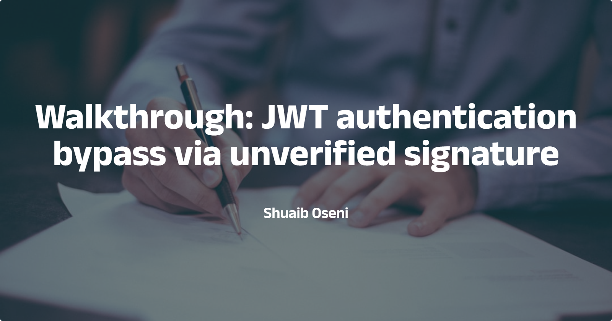

--- 
draft: false
date: 2023-06-13
title: "Walkthrough: JWT authentication bypass via unverified signature"
description: "A tutorial on how to solve portswigger's JWT authentication bypass via unverified signature lab."
slug: ""
authors: ""
tags:
- application security
- api security
images:

  - url: hero.png
    alt: cover image
categories: ""
externalLink: ""
series: ""
---

Javascript Web Token (JWT) is a secure way of transmitting information between parties as a JSON object. It comprises three parts: a **header,** a **payload**, and a **signature**. The header contains information about the token type and the hashing algorithm used to sign it. The payload contains the actual data that is being transmitted, such as the user's identity or a session ID. The signature is used to verify the authenticity of the token.

In this post, we’ll walk through Portswigger’s [JWT authentication bypass via unverified signature lab](https://portswigger.net/web-security/jwt/lab-jwt-authentication-bypass-via-unverified-signature).

Prerequisites

- Basic knowledge of Burp Suite
- Cookie Editor browser extension

**Lab description**
This lab uses a JWT-based mechanism for handling sessions. Due to implementation flaws, the server doesn't verify the signature of any JWTs it receives.
**Task**
To solve the lab, modify your session token to access the admin panel at `/admin`, then delete the user `carlos`.
**Credentials**
You can log in to your own account using the following credentials: `wiener:peter`

## What is  JWT unverified signature?

JWT unverified signature is a vulnerability that can occur when a server does not properly verify the signature of a JWT token. This can allow an attacker to modify the token and gain unauthorized access to resources.

## Walkthrough
1. Let’s intercept the web traffic by running Burp Suite in the background. 
2. Next, we login using the provided credentials

3. After getting in, let’s review the intercepted requests to confirm if the application uses JWT for authentication.

4. From the Cookie section, we confirm that the application uses JWT for authentication. Next, we need to decrypt the token. We can do this by installing the `jwt editor` extension in Burp Suite:
    1. In Burp Suite, click **Extensions**, then click **BApp Store**.
    2. In the search field, enter **jwt editor.**
    3. Click Install.
    

5. To decrypt the token, we need to send the request containing the jwt token to the repeater tab.

6. From this, we can understand that the `sub` value defines the user who is logged in. To verify if the server verifies the signature, we can edit the sub value and add `administrator` 

7. We can copy and paste our new JWT token into the session using the `cookie editor` browser extension.

8. If we navigate to the `/admin` page, we’ll have access to delete the user `carlos`

# Conclusion

This post introduced the reader to JWT unverified signature vulnerability and how to solve Portswigger’s JWT authentication bypass via unverified signature lab. 